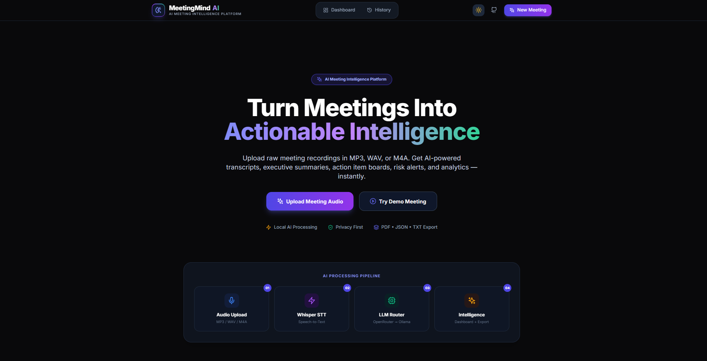
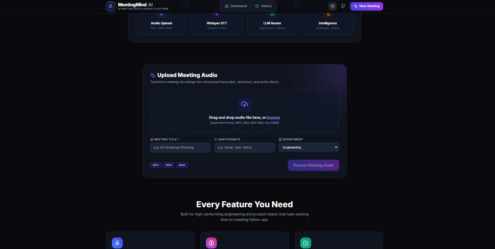
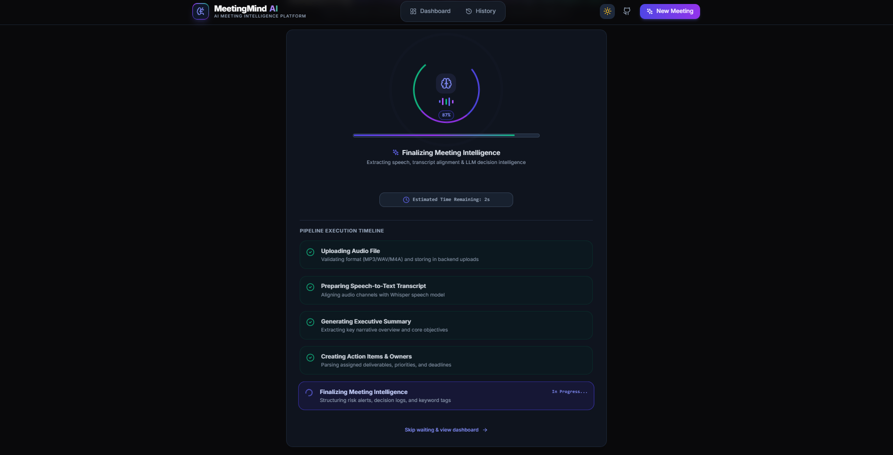
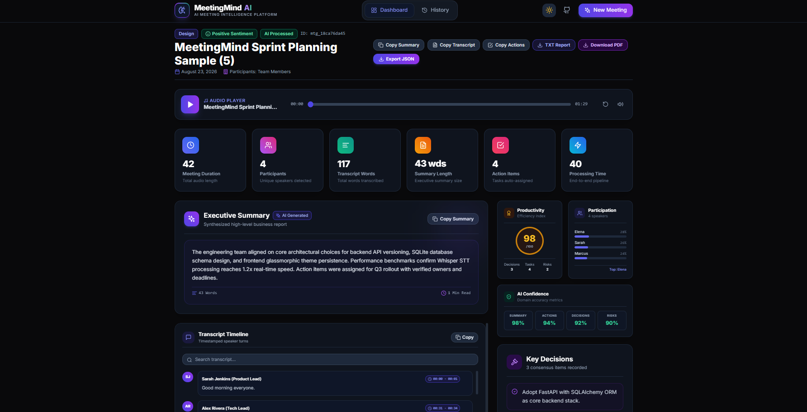
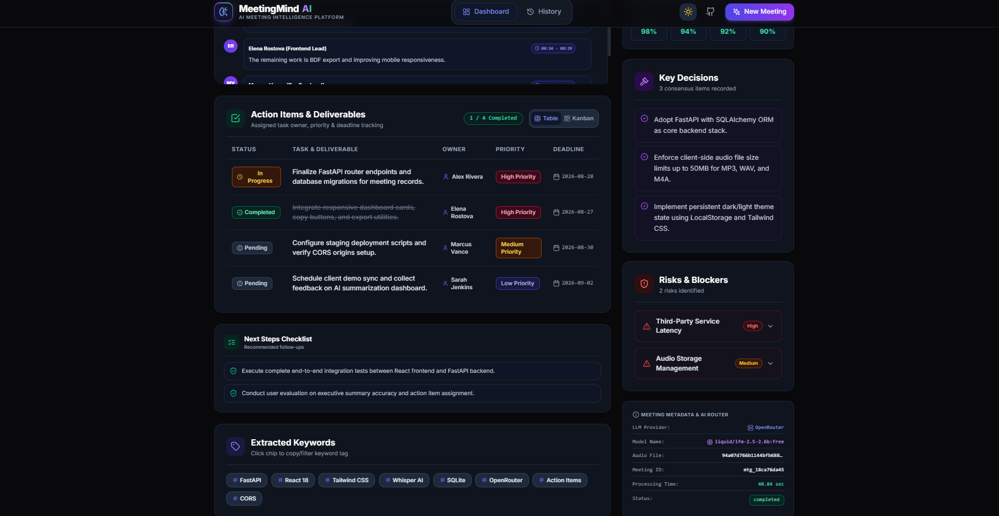
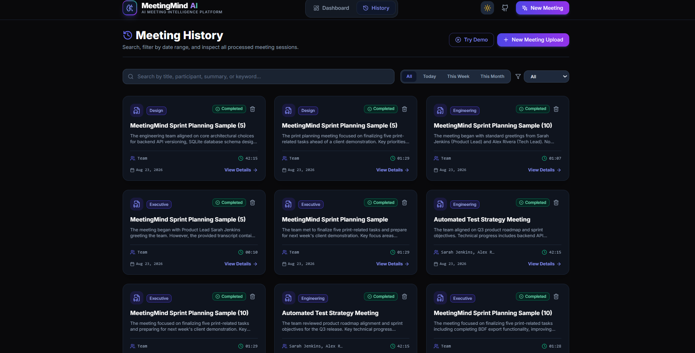
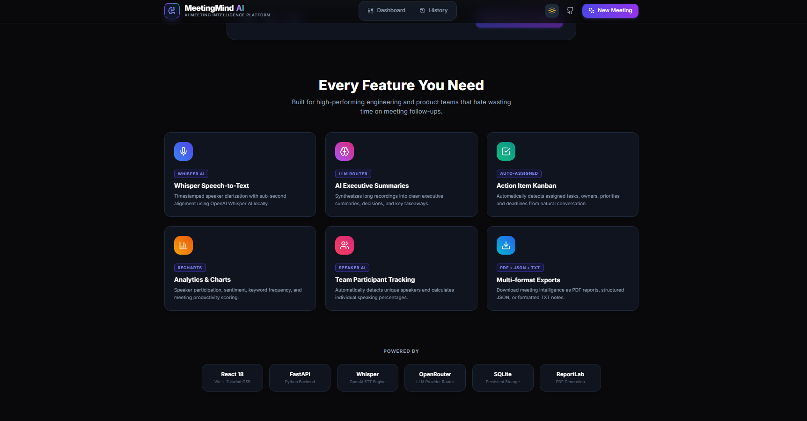
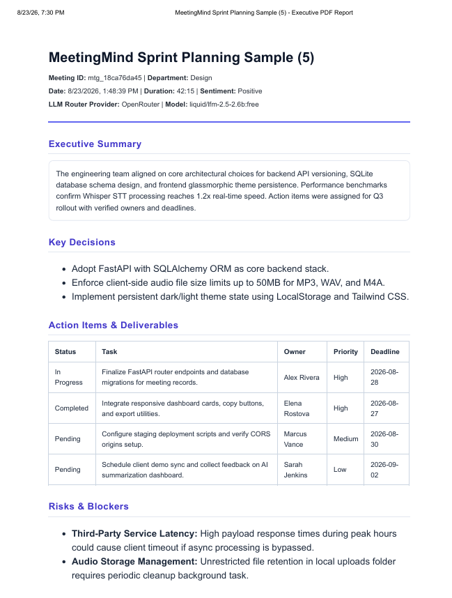
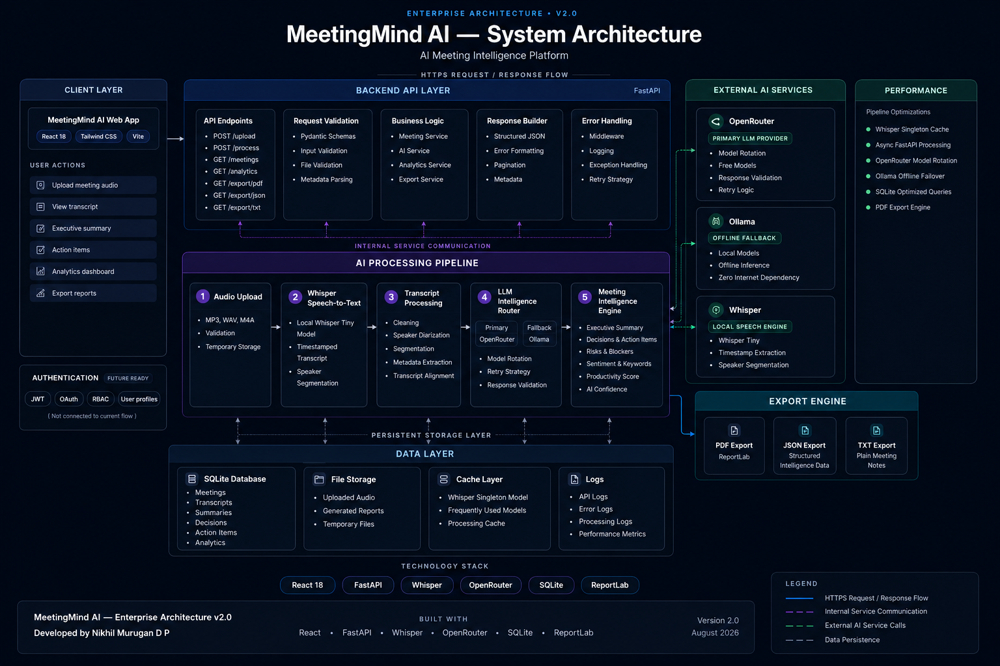

# MeetingMind AI

### AI Meeting Intelligence Platform

Built for **Unthinkable Internship Assignment**

Developed by **Nikhil Murugan D P**

MeetingMind AI transforms meeting recordings into structured business intelligence using Speech-to-Text and Large Language Models.

---

## Features

*  Whisper Speech-to-Text with timestamps
*  AI Executive Summary
*  Action Item Extraction
*  Speaker Participation Analytics
*  Risk & Blocker Detection
*  Next Step Checklist
*  PDF / JSON / TXT Export
*  Light & Dark Theme
*  Responsive Dashboard
*  Meeting History

---

## Screenshots

### 1. Landing Page



### 2. Upload Meeting Audio



### 3. AI Processing Pipeline



### 4. Dashboard Overview



### 5. Transcript, Action Items & Risks



### 6. Meeting History



### 7. Features Section



### 8. PDF Export Report



---

## System Architecture



## Tech Stack

| Layer          | Technology                                 |
| -------------- | ------------------------------------------ |
| Frontend       | React 18, Tailwind CSS, Vite               |
| Backend        | FastAPI, Python                            |
| Speech-to-Text | OpenAI Whisper                             |
| LLM            | OpenRouter (Free Models) + Ollama Fallback |
| Database       | SQLite                                     |
| PDF Export     | ReportLab                                  |

---

## Project Structure

```text
MeetingMind-AI/
├── frontend/              React + Tailwind CSS + Vite
├── backend/               FastAPI backend and AI pipeline
├── architecture/          System architecture diagram
├── screenshots/           UI screenshots used in README
├── demo-audio/            Sample meeting recording
├── demo-video/            Complete application walkthrough
├── .env.example           Environment variable template
└── README.md
```

---

# Quick Start

Follow these steps to run MeetingMind AI locally.

## 1. Clone the repository

```bash
git clone https://github.com/nikhilmurugan/MeetingMind-AI.git
cd MeetingMind-AI
```

## 2. Backend Setup

```bash
cd backend

python -m venv venv

venv\Scripts\activate

pip install -r requirements.txt
```

Create a `.env` file from `.env.example`.

```env
OPENROUTER_API_KEY=your_api_key_here
```

Start FastAPI.

```bash
python -m uvicorn main:app --reload
```

Backend runs on:

```text
http://localhost:8000
```

## 3. Frontend Setup

Open another terminal.

```bash
cd frontend

npm install

npm run dev
```

Frontend runs on:

```text
http://localhost:5173
```

## 4. Test the Application

1. Open `http://localhost:5173`
2. Upload the sample audio from `demo-audio/`.
3. Generate transcript.
4. View executive summary.
5. Export PDF / JSON / TXT reports.

---

## Environment Variables

Copy `.env.example` to `.env` and add your own OpenRouter API key.

---

## Demo Audio

A sample sprint planning meeting audio is included inside `demo-audio/`.

---

## Demo Video

A complete demonstration of the MeetingMind AI workflow is included in the repository.

**Location**

demo-video/MeetingMind_AI_Demo.mp4

The video demonstrates:

- Landing Page
- Meeting Audio Upload
- AI Processing Pipeline
- Dashboard & Executive Summary
- Transcript Timeline
- Action Items & Risks
- Meeting History
- PDF / JSON / TXT Export

---

## Author

**Nikhil Murugan D P**

Built for the **Unthinkable Internship Assignment**.
